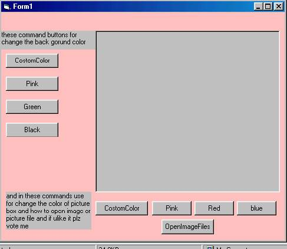



## rashidimageviewer

### Description

in this source code i add commands for how to change background color and how to change picture box color and how to open image files in picture box i modified these commands so easy and user can make image viewer by my source code he will tak help ok thenx and plz vote me.
 
### More Info
 

             |
---                |---
**Submitted On**   |2005-05-03 02:45:40
**By**             |[MUHAMMAD RASHID TURK](https://github.com/Planet-Source-Code/PSCIndex/blob/master/ByAuthor/muhammad-rashid-turk.md)
**Level**          |Beginner
**User Rating**    |2.3 (16 globes from 7 users)
**Compatibility**  |VB 6\.0
**Category**       |[Graphics](https://github.com/Planet-Source-Code/PSCIndex/blob/master/ByCategory/graphics__1-46.md)
**World**          |[Visual Basic](https://github.com/Planet-Source-Code/PSCIndex/blob/master/ByWorld/visual-basic.md)
**Archive File**   |[rashidimag188412532005\.zip](https://github.com/Planet-Source-Code/muhammad-rashid-turk-rashidimageviewer__1-60339/archive/master.zip)

